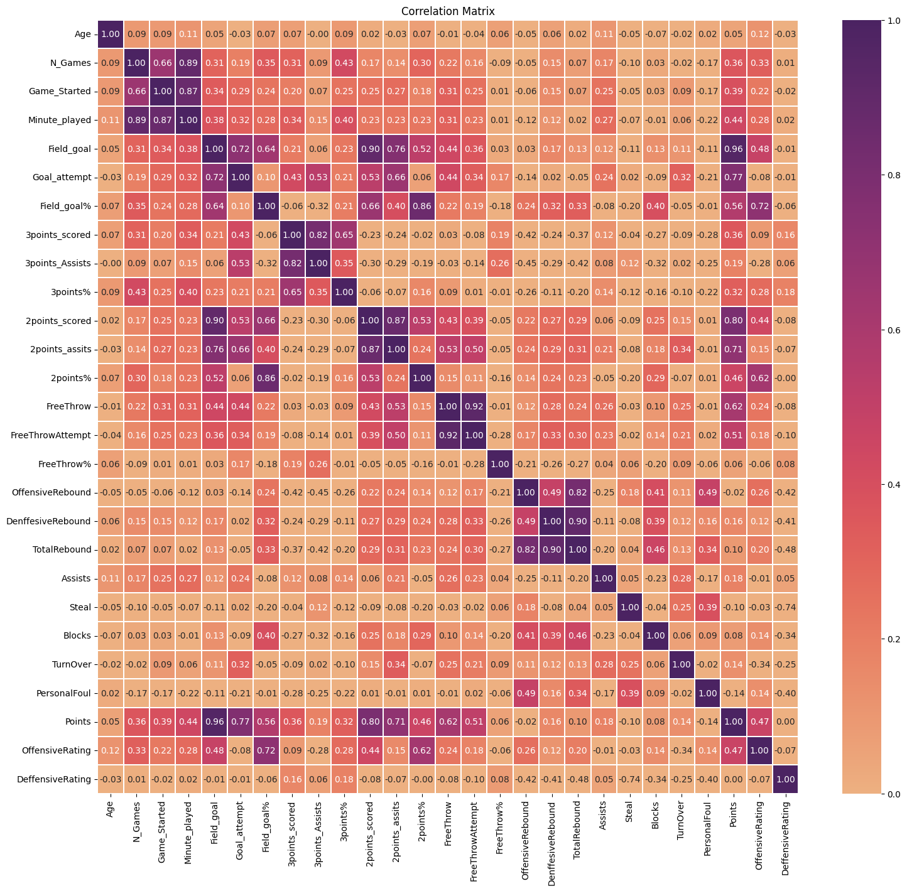
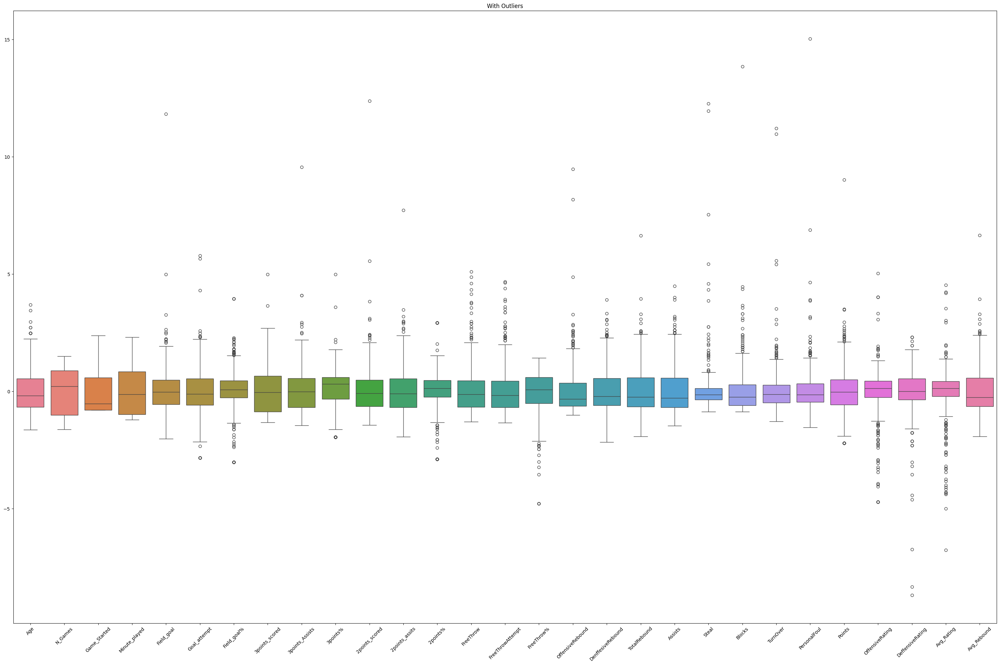
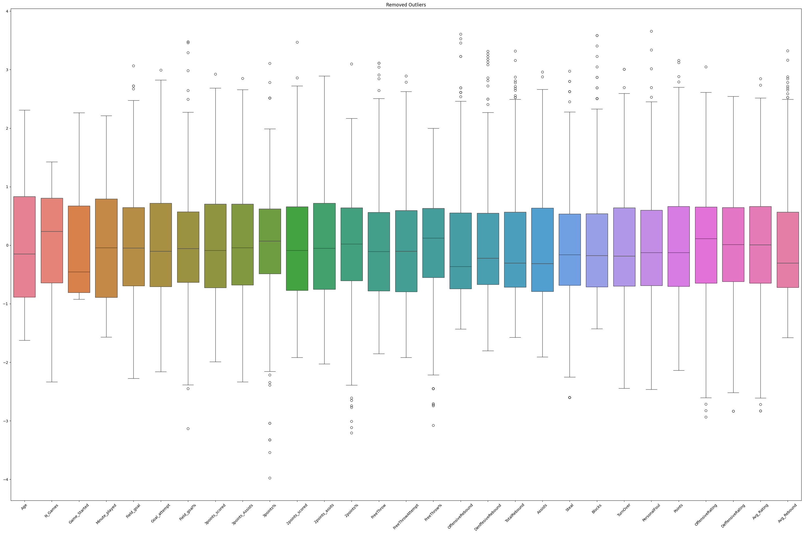
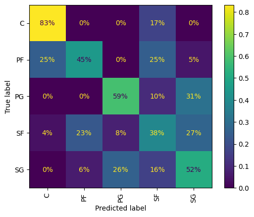
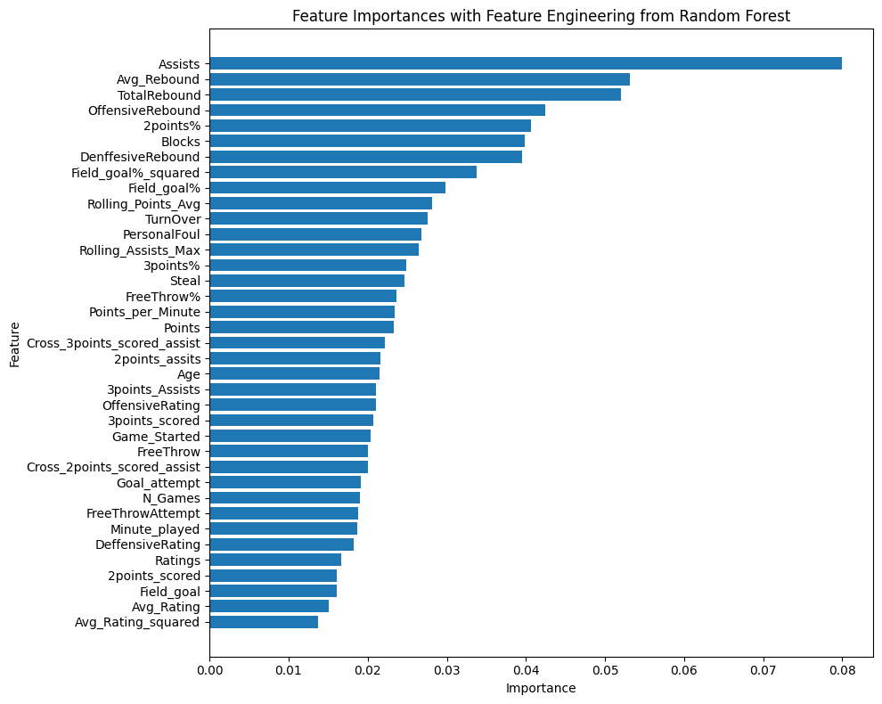
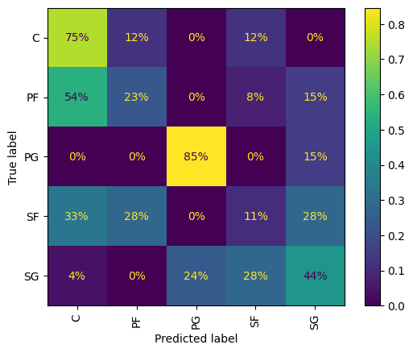
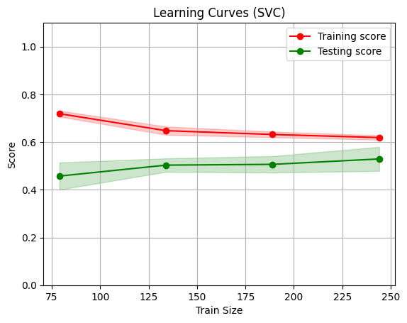

# Machine Learning Final Project Report

**Authors:** Isabelle Crow & Souley Diallo  

<u>[GitHub Repository](https://github.com/Clarkson-Applied-Data-Science/2024_IA651_Crow_Diallo)</u>

---

## Introduction

In this project, we investigate the application of machine learning techniques to predict NBA player positions based on performance metrics from the 2021-2022 regular season. We utilize a detailed dataset from basketball-reference.com, collected via the ballr package in R, encompassing statistics for 812 player-team stints. Our goal is to develop a predictive model that accurately classifies players into their respective positions based on various performance indicators.

Accurate prediction of player positions offers significant advantages for team management, game strategy, and player assessment. By analyzing these performance metrics, teams can make more strategic decisions regarding player deployment and overall game strategy. Additionally, we conduct a learning curve analysis to assess the model's performance and its capacity to generalize with varying amounts of training data. This report outlines our methodology, including data preparation, feature selection, and model evaluation, and provides a comprehensive overview of our approach and findings.


## Dataset Description

The dataset used in this project is the **National Basketball Association (NBA) Player Statistics** from the 2021-2022 regular season, sourced from [basketball-reference.com](https://data.scorenetwork.org/basketball/nba-player-stats.html). The data was collected using the `ballr` package in R, a tool designed to access current and historical basketball statistics.

This dataset encompasses statistics for 812 player-team stints during the 2021-2022 NBA season. It includes performance data for players across multiple teams, with individual rows representing each team's performance and a summary row indicating total performance for players who were traded (where `tm = TOT` denotes total season performance). All statistics are normalized per 100 team possessions to account for variations in playing time.

**Variables in the dataset:**
- **player:** Name of the player
- **pos:** Player’s designated position
- **age:** Player’s age as of February 1st of the season
- **tm:** Name of the team
- **g:** Number of games played
- **gs:** Number of games started
- **mp:** Number of minutes played
- **fg:** Field goals per 100 team possessions
- **fga:** Field goal attempts per 100 team possessions
- **fgpercent:** Field goal percentage
- **x3p:** Three-point field goals per 100 team possessions
- **x3pa:** Three-point field goal attempts per 100 team possessions
- **x3ppercent:** Three-point field goal percentage
- **x2p:** Two-point field goals per 100 team possessions
- **x2pa:** Two-point field goal attempts per 100 team possessions
- **x2ppercent:** Two-point field goal percentage
- **ft:** Free throws per 100 team possessions
- **fta:** Free throw attempts per 100 team possessions
- **ftpercent:** Free throw percentage
- **orb:** Offensive rebounds per 100 team possessions
- **drb:** Defensive rebounds per 100 team possessions
- **trb:** Total rebounds per 100 team possessions
- **ast:** Assists per 100 team possessions
- **stl:** Steals per 100 team possessions
- **blk:** Blocks per 100 team possessions
- **tov:** Turnovers per 100 team possessions
- **pf:** Personal fouls per 100 team possessions
- **pts:** Points per 100 team possessions
- **ortg:** Offensive Rating (estimate of points produced per 100 possessions)
- **drtg:** Defensive Rating (estimate of points allowed per 100 possessions)

## Prediction Objective

The primary goal of this project is to predict NBA player positions based on various performance metrics. Accurate prediction of player positions can enhance team strategies and player evaluations, thereby contributing to more informed decision-making in both team management and player scouting. 

## Process Overview

The project follows a structured approach to develop and evaluate predictive models for NBA player positions. Here’s a summary of the process:

1. **Data Preparation**
   - **Feature Selection:** We identified the most relevant features for predicting player positions, such as assists, rebounds, and shooting percentages. We also applied feature engineering to create new features and encoded categorical variables for model training.
   - **Target Variable:** The target variable is the player position, which is a categorical variable representing different roles (e.g., PG, SG, SF).

2. **Data Splitting**
   - The dataset was split into training and testing sets using an 80/20 split ratio. This division ensures that models are trained on one portion of the data and evaluated on another, unseen portion.

3. **Pipeline Creation**
   - **Preprocessing Pipelines:** We created pipelines for each classifier to integrate preprocessing steps and modeling within a single workflow. The pipelines included:
     - **StandardScaler:** To standardize feature values.
     - **SMOTE:** To address class imbalance by oversampling minority classes.
   - **Classifiers:** We explored two classifiers:
     - **Support Vector Classifier (SVC)**
     - **Random Forest Classifier**

4. **Hyperparameter Tuning**
   - We used GridSearchCV for hyperparameter tuning to enhance model performance. This involved:
     - **Defining Hyperparameters:** We specified a range of hyperparameters for each classifier to explore.
     - **Cross-Validation:** Various KFold strategies were employed, including both StratifiedKFold and KFold with different numbers of splits, to ensure robust model evaluation.

5. **Model Evaluation**
   - **Performance Metrics:** After tuning, models were evaluated using accuracy, confusion matrices, and classification reports. This assessment provided insights into model performance and areas for improvement.
   - **Confusion Matrix:** We visualized the models' performance with confusion matrices to understand strengths and weaknesses.
   - **Learning Curve Analysis:** The learning curve analysis was conducted to assess the model's performance and generalization capability with varying amounts of training data.

6. **Results and Analysis**
   - The best-performing models were selected based on their best score and other metrics. The results highlighted the predictive power of different models and the impact of various hyperparameters.

This structured approach allowed us to build and refine predictive models systematically, ensuring robust and reliable predictions of NBA player positions.

### Exploratory Data Analysis (EDA)

For exploratory data analysis, we focused on both the features and the target variables. The features included metrics such as field goal percentage, points scored, and games played, while the target variable was the player position (e.g., guard, forward, center). This is a classification problem, given the categorical nature of player positions.

The dataset comprises 812 observations and 30 features. We noted that some features, such as field goal percentage, were imbalanced, which could impact model performance. Additionally, the distribution of player positions was analyzed to ensure balanced representation.

Correlation analysis revealed strong relationships among certain features, which was illustrated in the correlation matrix (Figure 1).

<p align="center">
  
  <br>
  <em>Figure 1: Correlation Matrix</em>
</p>

Next, we analyzed the distribution of categorical variables, presenting bar plots for each variable (see Figure 2).

<p align="center">
  
  <br>
  <em>Figure 2: Categorical Variable Distributions</em>
</p>

### Feature Engineering:

Feature engineering involved creating new features such as average rating and average rebound to capture the underlying data patterns more effectively. Additionally, cross features were generated to improve model performance and capture complex interactions between features.

### Identification and removal of outlier:

We utilized the interquartile range method to identify and eliminate outliers after completing the initial exploration.

<p align="center">
  
  <br>
  <em>Figure 3: Boxplots with Outliers</em>
</p>

<p align="center">
  
  <br>
  <em>Figure 4: Boxplot with Outliers Removed</em>
</p>

### Principal Component Analysis

We conducted a Principal Component Analysis (PCA) as part of our model evaluation process. However, the results did not significantly contribute to the enhancement of the model's performance or interpretability.

## Model Training, Testing, and Validation on the Original Datasets

Before determining feature importance, we trained, tested, and evaluated both a Support Vector Machine (SVC) and a Random Forest model. This involved hyperparameter tuning and grid search to optimize model performance on the original datasets. We employed oversampling techniques, scaling, and the use of pipelines to avoid data leakage. Through these methods, the SVC model achieved a score of 56.28%.

- **StratifiedKfold: n_split** 10
- **Best Score:** 56.28%
- **Best Parameters:** 
  - `kernel`: 'rbf'
  - `C`: 1
  - `gamma`: 0.01 

_Table 5: Classification Report_

  |                  | precision | recall | f1-score | support |
  | ---------------- | --------- | ------ | -------- | ------- |
  | C                | 0.62      | 0.83   | 0.71     | 12      |
  | PF               | 0.53      | 0.45   | 0.49     | 20      |
  | PG               | 0.63      | 0.59   | 0.61     | 29      |
  | SF               | 0.40      | 0.38   | 0.39     | 26      |
  | SG               | 0.48      | 0.52   | 0.50     | 31      |
  | **accuracy**     |           |        | 0.53     | 118     |
  | **macro avg**    | 0.53      | 0.55   | 0.54     | 118     |
  | **weighted avg** | 0.52      | 0.53   | 0.52     | 118     |

Figure 7 below shows the confusion matrix for this SVC model from above.

<p align="center">
  
  <br>
  <em>Figure 7: Confusion Matrix</em>
</p>

#### Defining the Pipeline
The following code snippet illustrates how we defined the pipeline to obtain the SVC model. We incorporated `StandardScaler()` and `SMOTE()` with a random state of 42 to ensure consistency.

```{python}
svc_pipeline = Pipeline(steps=[
    ('scaler', StandardScaler()),
    ('smote', SMOTE(random_state=42)),
    ('svc', SVC(class_weight='balanced', random_state=42))
])
```

### Feature Importance
Prior to model selection, training, and evaluation, we employed a random forest classifier to identify the most significant features for predicting the target variable. This process aids in reducing noise, which can lead to overfitting and degrade model performance.

<p align="center">
  
  <br>
  <em>Figure 8: Feature Importance After Feature Engineering</em>
</p>

## Model Selection and Hyperparameter Tuning

### Model Selection

For model selection, we explored several classifiers to determine the most effective approach for predicting NBA player positions. The classifiers considered were:

- **Support Vector Classifier (SVC)**
- **Random Forest Classifier**

We utilized pipelines to integrate preprocessing steps and modeling within a single workflow. This approach helped in preventing data leakage and ensured consistent preprocessing across all models. 

The pipelines for each classifier included:
- **StandardScaler:** To standardize feature values.
- **SMOTE:** To address class imbalance by oversampling minority classes.

### Hyperparameter Tuning

To enhance model performance, we performed hyperparameter tuning using GridSearchCV. This process involves:
1. Defining a range of hyperparameters for each classifier.
2. Evaluating model performance across different hyperparameter combinations using cross-validation.

The hyperparameters tuned for each model were:

- **Support Vector Classifier (SVC):**
  - `kernel`: ['linear', 'poly', 'rbf', 'sigmoid']
  - `degree`: [1, 2, 3, 4]
  - `C`: [1, 10, 100, 200, 300]
  - `gamma`: [0.1, 0.01, 0.001, 1]

- **Random Forest Classifier:**
  - `n_estimators`: [1, 10, 100, 200, 500, 600]
  - `max_depth`: [10, 50, 100, 200, 400, 500]
  - `bootstrap`: [True]
  - `max_features`: ['sqrt', 'log2']
  - `criterion`: ['gini', 'entropy']

### Cross-Validation Strategies

We evaluated models using various KFold strategies to ensure robust performance assessment:
- **StratifiedKFold**: 3, 5, 10, 20 splits
- **KFold**: 3, 5, 10, 20 splits

This diverse range of cross-validation strategies allowed us to assess model stability and generalization capabilities under different validation conditions.

### Results

The GridSearchCV was applied to each classifier using the defined hyperparameter grids and cross-validation strategies. The scoring metric chosen for model evaluation was `balanced_accuracy`, rather than other options such as accuracy or F1-score. This decision was made because the dataset exhibited class imbalance, where some player positions were more represented than others. The `balanced_accuracy` metric accounts for this imbalance by computing the average of recall obtained on each class, thereby providing a more comprehensive assessment of model performance across all classes. This ensures that the model's ability to correctly identify players in less represented positions is equally weighted, leading to a more equitable evaluation of predictive performance. Below are the results from the model tuning:

#### Support Vector Classifier (SVC)
- **StratifiedKfold: n_split** 3
- **Best Score:** 56.85%
- **Best Parameters:** 
  - `kernel`: 'sigmoid'
  - `C`: 1
  - `gamma`: 0.1


#### Confusion Matrix and Classification Report

To evaluate classification performance, we analyzed confusion matrices and classification reports. These metrics provided insights into the precision, recall, and F1-score for each class. The confusion matrix and classification report for our best model, based on the highest score, are presented below in Table 6 and Figure 9.

_Table 6: Classification Report_
|                  | Precision | Recall | F1-Score | Support |
| ---------------- | --------- | ------ | -------- | ------- |
| C                | 0.30      | 0.75   | 0.43     | 8       |
| PF               | 0.33      | 0.23   | 0.27     | 13      |
| PG               | 0.65      | 0.85   | 0.73     | 13      |
| SF               | 0.18      | 0.11   | 0.14     | 18      |
| SG               | 0.55      | 0.44   | 0.49     | 25      |
| **Accuracy**     |           |        | 0.43     | 77      |
| **Macro Avg**    | 0.40      | 0.48   | 0.41     | 77      |
| **Weighted Avg** | 0.42      | 0.43   | 0.41     | 77      |

<p align="center">
  
  <br>
  <em>Figure 9: Confusion Matrix</em>
</p>

This analysis revealed areas where the model performed well and identified classes with lower precision and recall.

### Learning Curve Analysis

The learning curve provides insights into the model's performance as the size of the training data increases. By plotting the training and cross-validation scores, we can detect overfitting or underfitting and understand how the model benefits from more data.

We used the `learning_curve` function from `sklearn.model_selection` to generate the learning curves for the Support Vector Classifier (SVC) pipeline. The pipeline includes scaling, Synthetic Minority Over-sampling Technique (SMOTE) for handling imbalanced classes, and the SVC model.

The learning curves plot both the training score and the cross-validation score against the number of training examples. The red line represents the training score, which indicates the model's performance on the training data. A high training score suggests that the model fits the training data well. The green line represents the cross-validation score, which is crucial as it shows the model's ability to generalize to new, unseen data. A large gap between the training and cross-validation scores would suggest overfitting, meaning the model performs well on the training data but poorly on the test data. Conversely, a small gap suggests good generalization. 

<p align="center">
  
  <br>
  <em>Figure 10: Learning Curve</em>
</p>

In our case, the learning curve shows that as the number of training examples increases, the cross-validation score improves and stabilizes, while the training score slightly decreases but remains high. This behavior suggests that the model is not overfitting and benefits from more training data, indicating a good generalization capability. Overall, the learning curve analysis demonstrates that our SVC model with the specified parameters and pipeline is well-suited for the dataset, generalizing well to new data without significant overfitting, and could potentially benefit from additional training data to further enhance its performance.

### Model Comparison based on data
After applying feature engineering and determining feature importance, we observed that the model’s performance was slightly higher compared to the original dataset, with a best score of 56.85% versus 56.28%. However, this performance difference is not significant, indicating that the need for more data persists.

### Model Limitations
A significant limitation of this model is the small size of the dataset, which may also include synthesized data. Acquiring additional data from a reliable source would enhance the model’s performance and mitigate issues related to synthesized data.

### Sample Test
We generated three rows of new test data. The predicted labels are summarized below.

_Table 7: Predicted Labels_

|  Actual  |  Prediction  |
|:--------:|:------------:|
|    C     |      C       |
|    PF    |      SG      |
|    SG    |      SG      |

The first player has exceptionally high total rebounds (19.7), defensive rebounds (9.5), and blocks (9.2). These are key attributes of a Center (C) who typically excels in defense, rebounding, and blocking shots. The high field goal percentage (0.959) further supports this position, as Centers often take high-percentage shots close to the basket. The model correctly identifies the player as a Center.

The second player’s metrics show relatively low rebounds (total and defensive) and a low field goal percentage (0.12), which are unusual for a Power Forward (PF), who generally contributes more to rebounding and scoring efficiently. The high turnover rate (9.1) and personal fouls (9.0) are also atypical. However, the high offensive rebounds (4.4) might indicate a more active role in offense, which can sometimes align with a Shooting Guard’s (SG) responsibilities. Although the model predicts SG, which seems unusual for traditional metrics of a Power Forward, this might indicate the player has attributes more aligned with a guard’s role in the dataset.

The third player has moderate assists (5.9), total rebounds (6.0), and a relatively low field goal percentage (0.02), which is common for a Shooting Guard (SG) who might take more perimeter shots and have varied shooting efficiency. The model accurately identifies the player as an SG, indicating it correctly captures the player's role based on these attributes.

## Conclusion
In this project, we successfully developed a model to predict NBA player positions using performance metrics from the 2021-2022 regular season. Through a structured approach encompassing data preparation, feature engineering, and rigorous model evaluation, we identified the Support Vector Classifier (SVC) with an RBF kernel as our best-performing model, achieving a classification accuracy of 56.85%. The integration of feature scaling, oversampling techniques, and hyperparameter tuning contributed significantly to the model's performance.

Our analysis highlighted key insights into the relationships between various performance metrics and player positions, emphasizing the importance of specific features such as field goals, assists, and rebounds. The use of these features provided valuable information for refining our model and improving predictive accuracy.

While our model shows promise, the results also reveal areas for further improvement, particularly in handling class imbalances and optimizing overall model performance.

### Next Steps
To build on the findings of this project, several avenues for future work are recommended. Enhancing feature engineering by incorporating additional advanced features and interactions between existing features, as well as leveraging domain-specific knowledge, could create more meaningful features that better capture the nuances of player performance. Further model optimization can be pursued by experimenting with sophisticated machine learning models such as gradient boosting machines or deep learning architectures, and implementing ensemble methods to combine the strengths of multiple classifiers and improve predictive performance. Handling class imbalance remains a critical area for improvement, and more robust techniques such as advanced sampling methods or cost-sensitive learning should be investigated.

Expanding the dataset to include multiple seasons would enable temporal analysis, allowing for the assessment of player performance trends over time and the use of time-series forecasting techniques to predict player performance and transitions between positions. Collaborating with basketball analysts and coaches to incorporate expert knowledge and domain-specific insights into the model development process could customize the model to address specific strategic needs of teams, such as optimizing player rotations or scouting for potential trades. Finally, validating the model's predictions in real-world scenarios, such as during actual games or practice sessions, and gathering feedback from coaches and players, would refine the model and ensure it meets the needs of end-users. By pursuing these next steps, we can enhance the robustness and applicability of our predictive model, ultimately contributing to more informed decision-making in the realm of basketball team management and strategy.

## References

1. Basketball-Reference.com. (2024). NBA Player Statistics.
2. `ballr` package documentation.


